# NS Music — Arquitetura

> Complementa [CODEBASE_MAP.md](CODEBASE_MAP.md) (onde estão as coisas). Aqui: como as peças conversam e por quê.
> Atualizado em 2026-08 após os Lotes 0-8 do [audit/FIX_PLAN.md](audit/FIX_PLAN.md).

## 1. Arquitetura atual

Aplicação Next.js 14 monolítica rodando **inteiramente no Edge da Cloudflare Pages**, sem servidor
Node.js, sem banco relacional e sem camada de serviço. O Firestore é acessado com o **SDK cliente do
Firebase** tanto no browser quanto dentro das rotas Edge — o projeto não usa Firebase Admin SDK em
lugar nenhum.

Essa continua sendo a decisão estrutural mais consequente do sistema: **não existe uma identidade
privilegiada de servidor** ao nível do Firestore. As rotas de API já verificam identidade de admin via
ID token (`src/lib/auth.js:requireAdmin`) e já são a única autoridade sobre preço e status de
pagamento — mas isso é aplicado **na camada de aplicação** (dentro das rotas), não na camada do banco.
As regras do Firestore (`firestore.rules`) existem como rascunho versionado, mas **não foram
publicadas**: publicá-las hoje quebraria as próprias rotas de API, que ainda acessam o Firestore com a
mesma identidade anônima do browser.

```mermaid
graph TD
    B["Browser<br/>/criar · /entrega · /admin"]
    E["Rotas Edge<br/>src/app/api/*<br/>(requireAdmin nas rotas sensíveis)"]
    FS[("Firestore<br/>orders · suno_tasks<br/>regras ainda não publicadas")]
    ST[("Firebase Storage")]

    B -->|"fetch + Authorization: Bearer idToken (admin)"| E
    B -->|"SDK cliente: getDoc/getDocs com where, sem varredura completa"| FS
    B -->|"upload de fotos/capa"| ST
    E -->|"SDK cliente (lite)"| FS

    E --> KIE["Kie.ai / Suno<br/>(webhook autenticado por segredo)"]
    E --> AI["OpenAI → Gemini"]
    E --> EFI["Efí — API Pix<br/>(mTLS obrigatório em toda chamada)"]
    E --> WA["W-API WhatsApp"]

    KIE -.->|"callback"| E
    EFI -.->|"webhook"| E

    style FS fill:#4a2020,stroke:#c04040
    style B fill:#2a3a52,stroke:#5588cc
```

O browser ainda escreve alguns campos diretamente em `orders` (ex: `total`, `package`,
`admin/pedidos/[id]/page.jsx:paymentStatus` pelo admin) — mas nenhum campo de **aprovação de
pagamento ou acesso pago** é mais gravado pelo cliente fora do painel admin (ver C-01/C-12 no
AUDIT_REPORT.md, corrigidos no Lote 2).

## 2. Comunicação entre camadas

| De → Para | Mecanismo | Observação |
|---|---|---|
| Browser → API (rotas admin) | `fetch` JSON + `Authorization: Bearer <idToken>` | Verificado no servidor via `requireAdmin()` |
| Browser → API (rotas públicas) | `fetch` JSON, sem credenciais | Por design — usadas durante a criação/pagamento por qualquer visitante |
| Browser → Firestore | SDK cliente, config `NEXT_PUBLIC_*` | Leitura com `where`; escrita restante é metadado não-sensível (ver acima) |
| Edge → Firestore | `firebase/firestore/lite` | Mesma identidade anônima do browser — sem identidade de serviço |
| Edge → externos | `fetch` com `Bearer` + `AbortSignal.timeout()` (B-08); retry com backoff (`src/lib/httpRetry.js`) | Segredos via `getRequestContext().env` com fallback `process.env`, nunca hardcoded |
| Edge → Worker `efi-proxy` → Efí | `fetch` HTTPS simples até um Worker dedicado (`workers/efi-proxy/`, segredo `EFI_PROXY_SECRET`), que detém o binding `EFI_MTLS_CERT` e repassa com **mTLS** | Cloudflare Pages não suporta binding mTLS (só Workers); toda chamada (OAuth2, criar cobrança, consultar status) exige o certificado — ver `docs/EFI_SETUP.md` |
| Efí → Edge | Webhook POST (`api/webhooks/efi`) | Segredo `?secret=` na URL como primeira barreira; nunca aprova sem reconsultar `GET /v2/cob/{txid}` na mesma requisição |
| Kie.ai → Edge | Webhook POST | Exige `?secret=` na URL de callback se `KIE_WEBHOOK_SECRET` estiver configurado (A-03) |

## 3. Decisões arquiteturais

1. **Edge-only, sem Node.js.** Motivou o uso de `firebase/firestore/lite` e a ausência do Admin SDK.
2. **Firestore como única fonte de verdade**, sem camada de repositório — mas com módulos
   compartilhados para as regras que mais importavam: `src/lib/pricing.js` (preço),
   `src/lib/payments.js` (aprovação), `src/lib/auth.js` (identidade de admin),
   `src/lib/whatsappTemplates.js` (mensagens).
3. **Geração antes do pagamento.** A música é produzida assim que a letra é aprovada; o pagamento
   apenas libera o download. Continua sendo um risco de abuso de custo de API — mitigado
   parcialmente por A-11 (limite de prévias grátis agora reforçado no servidor).
4. **PIX via API real (Efí), não mais estático.** Até 2026-08, o PIX era um BR Code montado à mão
   (chave PIX hardcoded no código-fonte) sem nenhum gateway de fato, com aprovação manual pelo
   painel admin — bypass adotado depois de dois bloqueios seguidos da conta do Mercado Pago (o
   segundo, muito provavelmente, por abertura de conta nova ser tratada como evasão pelo PSP).
   Migrado para a API Pix da Efí (`src/lib/efi.js`): cobrança real via `PUT /v2/cob/{txid}`,
   confirmação via webhook (`api/webhooks/efi`) + polling, ambos reconsultando `GET /v2/cob/{txid}`
   antes de aprovar. Exige mTLS em toda chamada — ver `docs/EFI_SETUP.md`.
5. **Confirmação de pagamento unificada.** `src/lib/payments.js:applyPaymentApproval` é o único
   ponto de aprovação (M-18), consumido pelo webhook da Efí e pelo polling, com `runTransaction`
   para idempotência (A-09) e tratamento de estornos/cancelamentos.
6. **Renderização de vídeo no cliente.** Evita infraestrutura de encoding, mas amarra o resultado ao
   desempenho e à aba aberta do dispositivo do usuário. Código agora carregado via `import()`
   dinâmico (code splitting, Lote 6) em vez de estático.
7. **Identidade de admin em duas camadas.** ID token do Firebase verificado no servidor via Identity
   Toolkit + (custom claim `admin:true` OU allowlist `ADMIN_EMAILS`) — a checagem de e-mail no
   browser (`admin/page.jsx`, etc.) hoje é só roteamento de UI, não controle de acesso.

## 4. Pontos críticos remanescentes

- **Migração para a Efí pendente de configuração externa.** O código está pronto, mas só funciona
  depois do Worker `workers/efi-proxy/` ser deployado com o certificado mTLS vinculado
  (`EFI_MTLS_CERT`, via `wrangler mtls-certificate upload` — binding exclusivo de Workers, não existe
  para Pages) e dos secrets/env vars (`EFI_CLIENT_ID`, `EFI_CLIENT_SECRET`, `EFI_PIX_KEY`,
  `EFI_PROXY_URL`, `EFI_PROXY_SECRET`, `EFI_WEBHOOK_SECRET`) serem cadastrados — ver
  `docs/EFI_SETUP.md`. Não foi testado contra a API real nesta sessão (sem credenciais). Devolução/
  estorno de Pix também não foi implementado (fora de escopo desta rodada).
- **Sem identidade de servidor ao nível do Firestore.** As rotas de API continuam sendo, do ponto de
  vista do Firestore, apenas mais um cliente anônimo — a autorização que existe hoje é toda
  implementada nas rotas (verificação de token), não nas regras do banco. Publicar
  `firestore.rules` (já rascunhado) exige primeiro resolver isso — ver o próprio arquivo
  `firestore.rules` para os 3 pré-requisitos documentados.
- **Rate limiting inexistente em qualquer camada** (A-04/A-12) — decisão do usuário foi documentar a
  recomendação (Cloudflare Rate Limiting Rules) em vez de implementar em código nesta rodada.
- **`admin/pedidos/[id]/page.jsx` ainda grava `paymentStatus` direto do Firestore** a partir do
  browser (painel admin, não qualquer visitante) — migrar para uma rota de API autenticada exigiria
  expandir `/api/orders/update` para todos os campos que esse formulário edita; fica para quando
  `firestore.rules` for publicado.
- **12 vulnerabilidades de dependência remanescentes** (M-21), todas via `undici` transitiva de
  `@firebase/*` — só resolvidas com `firebase` v11 (major bump, não executado sem autorização).
- **`criar/page.jsx` (1.788 linhas) e `entrega/page.jsx` (1.263 linhas)** ainda excedem o limite de
  400 linhas — parcialmente decompostos (Lote 7); os trechos de checkout/pagamento/polling foram
  deixados nos arquivos principais por risco de regressão sem teste visual disponível.

## 5. O que já não é mais verdade (histórico da auditoria original)

Para quem leu a auditoria original (`AUDIT_REPORT.md`) antes dos Lotes 0-8: os itens abaixo eram
verdade em 2026-08-01 e **foram corrigidos** — mantidos aqui só para não reintroduzir os mesmos bugs.

- Preço, status de pagamento e limite de prévias eram decididos só no browser → agora vêm do
  servidor (`pricing.js`, `payments.js`, `orders/create:isBlockedByFreeLimit`).
- `/entrega?status=success` liberava o produto sem pagar → `isPaid` não depende mais de `searchParams`.
- Chave da Kie.ai hardcoded no código → removida (chave rotacionada antes da remoção).
- `/api/orders/{search,update,delete}` e `/api/whatsapp/send` sem autenticação → exigem `requireAdmin()`.
- `/minhas-musicas` baixava a coleção inteira de pedidos → usa `where` com igualdade exata.
- Proxies de mídia aceitavam qualquer URL (SSRF) → allowlist de domínio (`proxyAllowlist.js`).
- Pagar o vídeo (R$ 6,90) liberava a música (R$ 9,99) → `paymentStatus` só é escrito quando o SKU
  realmente aprova a música.
- `node_modules` quebrado, sem `.eslintrc*`, sem testes, sem CI → tudo restaurado/criado.

## 6. Sugestões de evolução restantes

Em ordem de retorno sobre esforço:

0. **Concluir o setup da Efí** (`docs/EFI_SETUP.md`) e validar o fluxo completo em sandbox antes de
   trocar `EFI_ENV` para `production` — hoje é o item bloqueador para qualquer venda real voltar a
   funcionar de forma automática.
1. **Resolver a identidade de servidor** (custom claim `admin:true` já suportado no código — falta
   rodar `scripts/set-admin-claim.mjs` com credenciais reais — e uma identidade de "serviço" para as
   rotas de API, para então poder publicar `firestore.rules`).
2. **Rate limiting real** via Cloudflare Rate Limiting Rules (painel, sem mudança de código).
3. **Migrar `admin/pedidos/[id]/page.jsx`** para escrever via API autenticada em vez de Firestore direto.
4. **Atualizar `firebase` para v11** (major bump) numa janela dedicada, com testes de regressão.
5. **Terminar a decomposição de `criar/page.jsx`/`entrega/page.jsx`** (checkout, polling, upload de
   vídeo) com ambiente de teste visual disponível.
6. **Adotar TypeScript incrementalmente** (`allowJs`), começando pelo modelo `Order` e pelas rotas de API.
