# NS Music — Arquitetura

> Complementa [CODEBASE_MAP.md](CODEBASE_MAP.md) (onde estão as coisas). Aqui: como as peças conversam e por quê.

## 1. Arquitetura atual

Aplicação Next.js 14 monolítica rodando **inteiramente no Edge da Cloudflare Pages**, sem servidor
Node.js, sem banco relacional e sem camada de serviço. O Firestore é acessado com o **SDK cliente do
Firebase** tanto no browser quanto dentro das rotas Edge — o projeto não usa Firebase Admin SDK em
lugar nenhum.

Essa é a decisão estrutural mais consequente do sistema: **não existe uma identidade privilegiada de
servidor**. As rotas de API são, do ponto de vista do Firestore, apenas mais um cliente anônimo. Elas
não conseguem autorizar nada que o browser já não pudesse fazer sozinho, e o único controle de acesso
possível são as regras do Firestore — que não estão versionadas no repositório.

```mermaid
graph TD
    B["Browser<br/>/criar · /entrega · /admin"]
    E["Rotas Edge<br/>src/app/api/*"]
    FS[("Firestore<br/>orders · suno_tasks")]
    ST[("Firebase Storage")]

    B -->|"fetch"| E
    B -->|"SDK cliente: getDocs, updateDoc, onSnapshot"| FS
    B -->|"upload de fotos"| ST
    E -->|"SDK cliente (lite)"| FS

    E --> KIE["Kie.ai / Suno"]
    E --> AI["OpenAI → Gemini"]
    E --> MP["Mercado Pago"]
    E --> WA["W-API WhatsApp"]

    KIE -.->|"callback"| E
    MP -.->|"webhook"| E

    style FS fill:#4a2020,stroke:#c04040
    style B fill:#2a3a52,stroke:#5588cc
```

A seta `Browser → Firestore` é o problema central: o browser escreve diretamente em `orders`,
inclusive o campo `paymentStatus` (`entrega/page.jsx:84-94`, `criar/page.jsx:228`).

## 2. Comunicação entre camadas

| De → Para | Mecanismo | Observação |
|---|---|---|
| Browser → API | `fetch` JSON, sem credenciais | Nenhum endpoint exige autenticação |
| Browser → Firestore | SDK cliente, config `NEXT_PUBLIC_*` | Leitura e **escrita** diretas |
| Edge → Firestore | `firebase/firestore/lite` | Mesma identidade anônima do browser |
| Edge → externos | `fetch` com `Bearer`, sem timeout nem retry | Segredos via `getRequestContext().env` com fallback `process.env` |
| Mercado Pago → Edge | Webhook POST e GET (IPN) | Sem validação de assinatura; mitigado por re-consulta à API do MP |
| Kie.ai → Edge | Webhook POST | Sem validação nenhuma |

## 3. Decisões arquiteturais descobertas

Nenhuma está documentada como ADR; foram inferidas do código e de `.agents/AGENTS.md`.

1. **Edge-only, sem Node.js.** Motivou o uso de `firebase/firestore/lite` e a ausência do Admin SDK.
   Comentário explícito em `webhooks/mercadopago/route.js:5`.
2. **Firestore como única fonte de verdade**, sem camada de repositório. Cada rota monta suas próprias
   queries; não há modelo compartilhado do pedido.
3. **Geração antes do pagamento.** A música é produzida assim que a letra é aprovada; o pagamento
   apenas libera o download. Torna o custo de API um risco direto de abuso.
4. **PIX manual.** Commits recentes (`3e58be5`, `612e100`) trocaram o PIX automático do Mercado Pago
   por um BR Code **estático** montado à mão em `payments/create/route.js:generatePixPayload`, com
   `txid` fixo `***`. Consequência: nenhum pagamento PIX pode ser conciliado automaticamente com um
   pedido — o webhook do Mercado Pago só funciona para o fluxo antigo.
5. **Dupla via de confirmação.** Webhook + polling implementam a mesma lógica de aprovação em dois
   arquivos, sem código compartilhado — já divergiram (o webhook grava `paidAt`, o polling não).
6. **Renderização de vídeo no cliente.** Evita infraestrutura de encoding, mas amarra o resultado ao
   desempenho e à aba aberta do dispositivo do usuário.
7. **Idempotência por flag booleana** (`whatsappSent`, `*Sending`) em vez de transação.

## 4. Pontos críticos

- **Fronteira de confiança inexistente.** O servidor não distingue um cliente legítimo de um `curl`.
  Preço, status de pagamento e identidade de admin são todos definidos no browser.
- **Sem `firestore.rules` no repositório.** É o único controle de acesso possível nesta arquitetura e
  está fora do controle de versão — não pode ser revisado, testado nem restaurado.
- **Concorrência.** Webhook e polling podem processar o mesmo pagamento simultaneamente; ambos fazem
  ler-e-depois-escrever sem transação.
- **Duas fontes para o resultado da música** (webhook Kie.ai + polling) convergindo na mesma função
  sem lock, com o `orderId` de destino aceito por query string no polling.
- **Segredo de terceiro versionado.** Fallback de chave de API embutido em `suno/generate/route.js:29`
  e `suno/status/route.js:30`.

## 5. Limitações

- JavaScript puro: nenhuma verificação estática de tipos entre frontend e backend.
- Sem testes, sem `typecheck`, sem CI. `next lint` nunca foi configurado (não há `.eslintrc*`).
- Sem observabilidade além de `console.log` (que hoje inclui telefones de clientes).
- Sem rate limiting em nenhuma camada.
- Componentes de 2789 e 1443 linhas violam o limite de 400 do próprio `.agents/AGENTS.md`.
- Consultas fazem varredura completa das coleções; o custo cresce linearmente com o número de pedidos.

## 6. Sugestões de evolução

Em ordem de retorno sobre esforço:

1. **Criar uma identidade de servidor.** Verificar ID token do Firebase nas rotas sensíveis e mover
   as escritas privilegiadas para trás dessa checagem. Onde o Edge for limitante, usar a REST API do
   Firestore com um service account em vez do SDK cliente.
2. **Versionar `firestore.rules`** negando escrita direta do browser em `orders`, e tornar as regras
   parte do processo de deploy.
3. **Tabela de preços no servidor.** O cliente envia `orderId` + SKU; o valor é derivado no backend.
4. **Unificar a confirmação de pagamento** em um único módulo `src/lib/payments.js` consumido pelo
   webhook e pelo polling, com transação Firestore e chave de idempotência por `paymentId`.
5. **Separar o estado do add-on de vídeo do estado do pedido**, eliminando a heurística de valor.
6. **Extrair `criar/page.jsx` e `entrega/page.jsx`** em componentes por etapa e hooks de dados.
7. **Adotar TypeScript incrementalmente** (`allowJs`), começando pelo modelo `Order` e pelas rotas de API.
8. **Testes de caracterização** do fluxo de pagamento antes de qualquer refatoração — ver
   [audit/FIX_PLAN.md](audit/FIX_PLAN.md), Lote 0.
