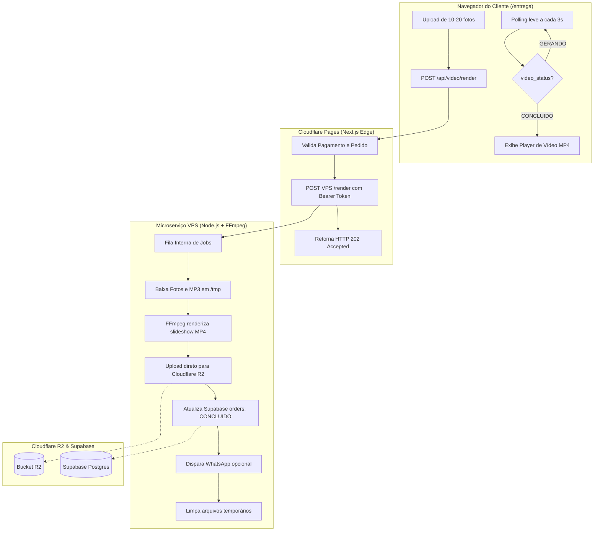

# Design Técnico: Microserviço de Geração de Vídeo na VPS (FFmpeg)

- **Data:** 28/09/2026
- **Status:** Aprovado para Planejamento
- **Módulo:** `workers/video-generator` e integração com `src/app/api/video/render`

---

## 1. Contexto e Problema Atual

Atualmente, o **Vídeo Homenagem** (slideshow com fotos e a música MP3 do pedido) é gerado exclusivamente no navegador do cliente (`src/lib/videoGenerator.js` via Canvas HTML5 e `MediaRecorder`).

### Problemas relatados pelos clientes:
1. **Tempo de Espera Obrigatório (1x Real-Time):** Por usar `MediaRecorder` capturando o áudio reproduzido, um vídeo de 3 minutos leva **obrigatoriamente 3 minutos inteiros** de renderização no celular.
2. **Bloqueio de Tela / Troca de Aba:** Se o cliente bloquear a tela, receber uma notificação ou mudar de aplicativo (ex: WhatsApp), o navegador mobile suspende o áudio ou congela o timer do Canvas, resultando em:
   - Vídeos sem áudio (mudos).
   - Vídeos travados ou dessincronizados.
   - Erro no upload final de 50MB no mobile.
3. **Consumo de Memória:** Carregar 10 a 20 fotos em alta resolução no canvas estoura a memória de aparelhos mais modestos.

---

## 2. Solução Proposta

Desacoplar a geração de vídeo do navegador e movê-la para um microserviço dedicado na **VPS**, utilizando **Node.js + FFmpeg**.

### Benefícios:
- **Velocidade:** FFmpeg não roda em tempo real (1x); ele codifica frames na velocidade máxima dos núcleos de CPU. Um vídeo de 3 minutos renderiza em **15 a 35 segundos**.
- **Independência do Cliente:** O cliente faz o upload das fotos (já existente para o R2) e pode fechar a página imediatamente. O processamento ocorre na VPS.
- **Padrão de Vídeo Garantido:** Saída em MP4 (H.264/AAC, baseline/main profile, `yuv420p`, `-movflags +faststart`), 100% aceito pelo WhatsApp e visualizadores móveis.
- **Transição e Qualidade:** Efeito suave de transição entre fotos e sincronização milimétrica com a música.

---

## 3. Arquitetura do Sistema



---

## 4. Estrutura do Novo Microserviço (`workers/video-generator`)

O serviço será completamente autocontido na pasta `workers/video-generator/`:

```
workers/video-generator/
├── Dockerfile                  # Imagem Alpine/Debian com Node 20 e FFmpeg
├── docker-compose.yml          # Configuração pronta para subir com 1 comando
├── package.json                # Dependências enxutas (express/fastify, @aws-sdk/client-s3, @supabase/supabase-js)
├── .env.example                # Template de variáveis de ambiente
├── server.js                   # API HTTP (rotas /health e /render, autenticação)
├── src/
│   ├── queue.js                # Fila de concorrência controlada (máx 2-3 renders simultâneos)
│   ├── downloader.js           # Download seguro de imagens e MP3 para pasta temporária
│   ├── ffmpegRunner.js         # Geração do vídeo vertical MP4 com transições e áudio
│   ├── r2Uploader.js           # Upload com streaming para o Cloudflare R2
│   └── orderUpdater.js         # Atualização de status e progresso no Supabase
└── README.md                   # Instruções passo a passo para o usuário rodar na VPS
```

---

## 5. Especificação dos Componentes

### 5.1. Endpoints da API na VPS
1. **`GET /health`**
   - Retorna: `{ status: "ok", ffmpeg: true, activeJobs: 0, queuedJobs: 0, uptime: 1234 }`.
2. **`POST /render`**
   - **Header:** `Authorization: Bearer <VPS_VIDEO_SECRET>`
   - **Body:**
     ```json
     {
       "orderId": "uuid-do-pedido",
       "imageUrls": [
         "https://media.nsmusic.ia.br/photos/foto1.jpg",
         "https://media.nsmusic.ia.br/photos/foto2.jpg"
       ],
       "audioUrl": "https://media.nsmusic.ia.br/audios/musica.mp3",
       "title": "Homenagem de João",
       "targetTrack": "v1"
     }
     ```
   - **Resposta Imediata (HTTP 202 Accepted):**
     ```json
     {
       "success": true,
       "message": "Renderização enfileirada com sucesso",
       "orderId": "uuid-do-pedido",
       "queuePosition": 1
     }
     ```

### 5.2. Pipeline de Renderização FFmpeg
- **Dimensões:** 720 x 1280 (vertical Reels/Stories/Shorts - ideal para celular).
- **Taxa de Quadros:** 25 fps.
- **Vídeo Codec:** `libx264`, preset `fast` (ou `medium`), CRF `23`, `pix_fmt yuv420p`.
- **Áudio Codec:** `aac`, bitrate `128k`, 2 canais, cópia ou re-encode estéreo.
- **Flags Web:** `-movflags +faststart` (permite streaming imediato antes de terminar download).
- **Cálculo de Tempo por Foto:** `duration = duracao_musica / quantidade_fotos`.
- **Transição:** Filtro `fade` ou `xfade` (0.5s de transição suave entre fotos).

### 5.3. Integração com Cloudflare R2
- Utiliza `@aws-sdk/client-s3` (S3 API nativa do R2).
- Salva o vídeo com chave única: `videos/${orderId}-${Date.now()}.mp4`.
- Constrói a URL pública usando `R2_PUBLIC_URL` (ex: `https://media.nsmusic.ia.br/videos/...`).

### 5.4. Atualização no Supabase Postgres
- Início: `video_status = 'GERANDO'`, `video_progress = 15`.
- Durante o processo: atualiza progresso conforme etapas (`download: 30%`, `ffmpeg: 70%`, `upload: 90%`).
- Conclusão:
  - `video_status = 'CONCLUIDO'`
  - `video_url = <url_final_r2>`
  - `video_progress = 100`
  - `video_created_at = <iso_timestamp>`
  - `updated_at = <iso_timestamp>`
- Falha:
  - `video_status = 'ERRO'`
  - `video_error = <mensagem_de_erro>`

---

## 6. Integração no Next.js (Cloudflare Pages)

Para atender a exigência de **não alterar ou quebrar a produção atual**:

1. **Variável de Controle (`VPS_VIDEO_URL`):**
   - No Cloudflare Pages, a variável `VPS_VIDEO_URL` será adicionada apenas quando a VPS estiver no ar.
   - Criamos o endpoint `src/app/api/video/render/route.js`.
   - Se `VPS_VIDEO_URL` estiver configurada:
     - O endpoint encaminha o pedido para a VPS e retorna 202.
   - Se `VPS_VIDEO_URL` **não** estiver configurada:
     - Retorna `{ vpsEnabled: false }`, permitindo que o front-end ou o sistema saiba que a VPS ainda não está conectada.

2. **Frontend `/entrega`:**
   - Mantemos a estrutura sem mexer agora, conforme solicitado. Quando o usuário estiver pronto para conectar a VPS, o botão de gerar vídeo chamará `/api/video/render` e exibirá a barra de progresso com polling.

---

## 7. Instruções de Implantação na VPS

No `workers/video-generator/README.md`, forneceremos o guia completo:
- Instalação do Docker e Docker Compose no Ubuntu/Debian.
- Configuração do arquivo `.env` (chaves do R2, Supabase e token secreto).
- Execução em background (`docker compose up -d`).
- Configuração opcional de Nginx com SSL grátis (Certbot) ou túnel Cloudflare (Cloudflare Tunnel) para expor a API de forma segura sem abrir portas desnecessárias.

---

## 8. Critérios de Sucesso
1. Código do worker 100% autocontido em `workers/video-generator`.
2. Geração de vídeo em ~20-30 segundos na VPS.
3. MP4 gerado com áudio limpo, sincronizado e sem erros de reprodução no WhatsApp.
4. Nenhuma alteração disruptiva no código de produção atual.
