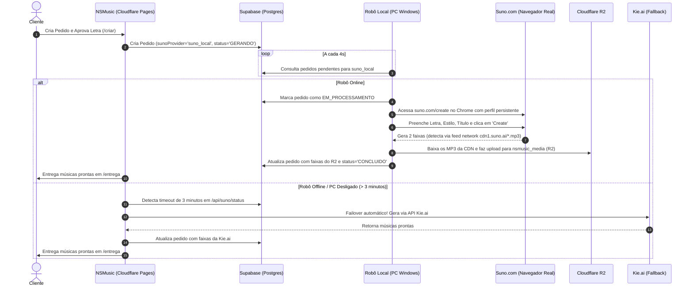

# Especificação de Design: Robô Local Suno (Worker Desktop) + Failover NSMusic

- **Data:** 07/10/2026
- **Status:** Aprovado em Brainstorming
- **Autor:** NSMusic / Antigravity AI

---

## 1. Visão Geral e Objetivo

Atualmente, o **NSMusic** utiliza provedores de terceiros (Kie.ai e Unifically) para gerar músicas a partir das letras aprovadas pelos clientes. Cada geração consome créditos pagos na API.

O proprietário do estúdio possui uma assinatura ativa no site oficial da **Suno** (Suno Pro/Premier) com créditos mensais disponíveis (2.500 a 10.000 créditos). Uma tentativa anterior de conectar uma VPS diretamente à API da Suno falhou porque os cookies de sessão e a proteção contra bots da Cloudflare/Clerk derrubavam a autenticação a cada poucas horas (erro 401).

### Solução Arquitetural
Construir um **Robô Local (Worker Desktop)** que executa no computador Windows do proprietário:
1. Roda com **Playwright** usando o navegador Google Chrome / Chromium com perfil persistente (`./perfil-chrome`), mantendo a sessão oficial do Suno logada de forma orgânica em IP residencial.
2. Monitora a fila de pedidos pendentes no **Supabase** via polling a cada 4 segundos (sem necessidade de ngrok, portas abertas ou IP fixo).
3. Preenche a letra, estilo e título no `suno.com/create`, clica em **Create** e intercepta as URLs dos MP3 da CDN (`cdn1.suno.ai/[uuid].mp3`).
4. Faz o upload imediato dos MP3 para o **Cloudflare R2** do NSMusic (evitando qualquer limitação de downloads da interface do Suno e garantindo que o arquivo fique permanentemente salvo no nosso storage com custo zero de tráfego).
5. Atualiza o pedido no Supabase como concluído e notifica o cliente.
6. Possui **failover automático para a Kie.ai após 3 minutos**, garantindo que nenhum cliente fique travado se o computador estiver desligado.

---

## 2. Diagrama de Arquitetura e Fluxo

---

## 3. Componentes Detalhados

### 3.1. Subprojeto Local: `local-worker/`
Isolado na raiz do repositório, com `package.json` próprio para não afetar o bundle do Next.js nem o deploy do Cloudflare Pages.

- **`local-worker/package.json`**:
  - `playwright`: automação do navegador.
  - `@supabase/supabase-js`: consulta e atualização direta no banco.
  - `dotenv`: carregamento das credenciais do Supabase.
- **`local-worker/iniciar-robo.bat`**:
  - Script executável com 2 cliques no Windows.
  - Verifica se o `node_modules` existe; se não, executa `npm install`.
  - Executa `node robo-suno.js` e exibe logs coloridos no console do Windows.
- **`local-worker/robo-suno.js`**:
  - Inicializa a conexão com o Supabase.
  - Envia um *heartbeat* para a tabela `config` ou `worker_heartbeats` a cada 30 segundos.
  - Loop assíncrono buscando pedidos onde `suno_provider = 'suno_local'` e `status_geracao = 'PENDENTE'`.
  - Invoca `suno-automator.js` para cada pedido.
- **`local-worker/suno-automator.js`**:
  - Executa `chromium.launchPersistentContext('./perfil-chrome', { headless: false, args: ['--start-maximized'] })`.
  - Abre `https://suno.com/create`.
  - Valida se o usuário está logado (se não, aguarda login na 1ª vez).
  - Garante o modo Custom (Personalizado) ativado.
  - Preenche os seletores de Letra, Estilo e Título.
  - Intercepta respostas da API interna do Suno (`/api/feed/` ou `/api/feed/v2/`).
  - Aguarda o status das 2 variações mudar para `complete`.
  - Extrai as URLs de áudio (`cdn1.suno.ai/[id].mp3`) e os IDs dos clipes.
  - Faz o upload dos arquivos para o Cloudflare R2 através da rota autenticada `/api/admin/voice/upload` (ou S3 SDK).
- **`local-worker/perfil-chrome/`**:
  - Diretório local contendo cookies, IndexedDB e LocalStorage da sessão do Suno.
  - Ignorado no `.gitignore` para nunca vazar credenciais.

---

### 3.2. Integração no NSMusic (`src/app/`)

1. **Roteamento de Geração ([`src/lib/suno.js`](file:///c:/Users/narci/OneDrive/Documentos/PROJETOS/nsmusic/src/lib/suno.js)):**
   - Na função `requestSunoGeneration`, adiciona suporte a `suno_local`:
   - Se o provedor configurado for `suno_local`, persiste a tarefa no Supabase com `sunoProvider: 'suno_local'` e `status: 'PENDENTE'`.
   - Não dispara chamada para Kie.ai imediatamente.

2. **Detecção de Timeout e Failover ([`src/app/api/suno/status/route.js`](file:///c:/Users/narci/OneDrive/Documentos/PROJETOS/nsmusic/src/app/api/suno/status/route.js)):**
   - Durante o polling do frontend, se `order.sunoProvider === 'suno_local'`:
   - Se o pedido estiver `CONCLUIDO`, retorna as faixas prontas.
   - Se o pedido estiver `PENDENTE` há mais de 180 segundos (3 minutos):
     - Executa failover transparente: chama `gerarPelaKie({ orderId, prompt, tags }, env)`.
     - Atualiza o pedido com `sunoProvider: 'kie'` e novo `sunoTaskId`.
     - O cliente continua na tela de loading e recebe a música vinda da Kie.ai sem interrupção.

3. **Painel Administrativo ([`src/app/admin/page.jsx`](file:///c:/Users/narci/OneDrive/Documentos/PROJETOS/nsmusic/src/app/admin/page.jsx)):**
   - Card com seletor de provedor: `Kie.ai (Padrão)`, `Unifically`, `Suno Local (PC)`.
   - Badge de status do robô em tempo real:
     - 🟢 **Robô Local Ativo** (heartbeat < 60s atrás).
     - 🔴 **Robô Local Desconectado** (failover para Kie.ai ativo).

---

## 4. Tratamento de Erros e Casos Extremos

| Cenário | Comportamento do Sistema |
|---|---|
| **PC Desligado / Sem Internet** | O pedido fica 3 minutos aguardando no Supabase; ao estourar o tempo, `/api/suno/status` desvia automaticamente para a Kie.ai. |
| **Suno sem Créditos ("Out of credits")** | O robô detecta a mensagem no DOM, marca o pedido como `FALHA_LOCAL` e dispara failover imediato para a Kie.ai. |
| **Moderação de Letra no Suno** | O robô reporta a rejeição no Supabase e marca para revisão manual ou geração de letra adaptada. |
| **Limite de Downloads do Suno** | Não se aplica: o robô captura o streaming bruto da CDN (`cdn1.suno.ai`) e sobe para o Cloudflare R2, sem clicar no botão de download da interface. |
| **Primeira Execução do Robô** | O navegador abre em modo visível. O usuário faz o login normalmente com Google/Discord. A sessão fica salva em `./perfil-chrome`. |

---

## 5. Plano de Testes e Validação

1. **Teste Unitário e de Isolamento:**
   - Garantir que o diretório `local-worker/` não afeta o build do Next.js (`npm run build` deve continuar passando 100%).
2. **Teste de Inicialização do Robô:**
   - Executar o robô localmente com Playwright, verificar se a pasta `./perfil-chrome` é gerada e se o login persiste.
3. **Teste de Geração Completa:**
   - Enviar um pedido teste para o Supabase com `sunoProvider: 'suno_local'`.
   - Observar o robô abrir o Suno, colar a letra/estilo, esperar as 2 faixas, fazer o upload para o R2 e atualizar o pedido.
4. **Teste de Failover Automático:**
   - Simular um pedido com robô desligado e verificar se a rota de status migra para a Kie.ai após 3 minutos.
